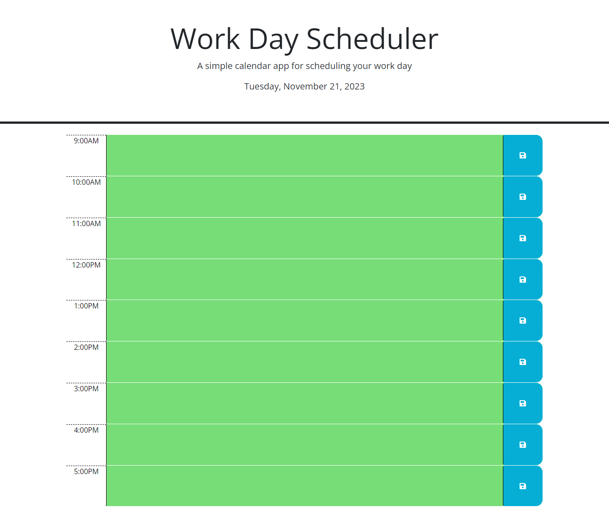

# Third-Party API's Weekday Scheduler

## Description
The purpose of this challenge was to show my ability to use jQuery to power a calendar browser application with HTML and CSS that is dynamically updated. This application also features the Day.js library, that was used to apply the current date, day and time to the applicaton.  I was able to demonstrate my ability to use various jQuery methods to bind events to certain webpage elements, apply classes to elements based on certain parameters, and use DOM traversal to target elements. I used Day.js to supply the current time in military format, and use JS logic to determine how certain elements would be styled according to their timing.

## Screenshot

## Link
[Scheduler Webpage URL](https://sailorshy94.github.io/3pAPIs-wkday-scheduler/)